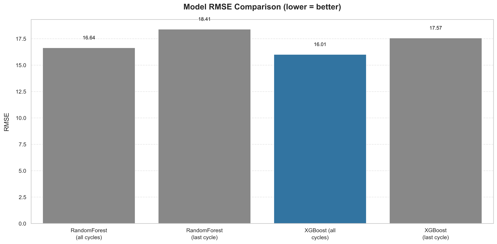

<p align="center">
  
</p>

<h1 align="center">🚀 NASA Turbofan Engine RUL Prediction (FD001)</h1>
<p align="center">
  End-to-end Machine Learning & Deep Learning pipeline for Predictive Maintenance.<br>
  <strong>By Kuntal (KayDee6070)</strong>
</p>


# NASA Turbofan Engine RUL Prediction (FD001)

**Goal:** Predict the Remaining Useful Life (RUL) of aircraft engines using NASA’s CMAPSS dataset.

---

## Overview

This project demonstrates a complete **end-to-end Machine Learning workflow** for predictive maintenance:

1. **Data ingestion** — Load CMAPSS FD001 data (train/test/RUL files)
2. **Feature engineering** — Rolling means, standard deviations, lags, and deltas per sensor
3. **Model training** — Random Forest, XGBoost, and LSTM
4. **Evaluation** — MAE and RMSE metrics
5. **Visualization** — Sensor correlations, feature importance, RUL vs. cycle plots
6. **Reporting** — Automatic PDF report with results and comparison chart

---

## Project Structure

```
turbofan-rul/
├── data/
│   ├── raw/              # NASA CMAPSS text files
│   └── processed/        # Engineered features
├── models/
│   ├── FD001_rf.joblib
│   ├── FD001_xgb.joblib
│   ├── FD001_lstm.h5
│   ├── FD001_comparison.png
│   └── FD001_model_report.pdf
├── src/
│   ├── data_prep.py
│   ├── train_baseline.py
│   ├── train_lstm.py
│   ├── eda_feature_importance.py
│   └── model_report.py
└── README.md
```

---

## Model Comparison Results

| Model | MAE | RMSE |
|:------|:----:|:----:|
| RandomForest (all cycles) | **11.97** | **16.64** |
| RandomForest (last cycle) | 13.06 | 18.40 |
| XGBoost (all cycles) | **11.63** | **16.01** |
| XGBoost (last cycle) | 12.63 | 17.56 |
| LSTM (deep learning) | 29.68 | 36.63 |



---

## Key Insights
- **Tree-based models** perform best with engineered features (RMSE ≈ 16).  
- **LSTM** learns temporal degradation trends and can improve with tuning.  
- **Top predictive sensors:** `s4`, `s9`, `s11`.  
- Demonstrates an **industry-ready predictive maintenance workflow**.

---

## Full Report
A detailed PDF report (with metrics and visual comparisons) is available in:
```
models/FD001_model_report.pdf
```

---

## Tech Stack
- Python, Pandas, NumPy, Matplotlib, Seaborn  
- Scikit-learn, XGBoost, TensorFlow/Keras  
- ReportLab for automatic PDF report generation

---

## Author
**Kuntal (KayDee6070)**  
Machine Learning & Data Engineering Projects Portfolio  
[GitHub Profile](https://github.com/KayDee6070)

---

## Next Steps
- Extend to FD002–FD004 datasets  
- Tune LSTM hyperparameters and sequence length  
- Deploy the model using Streamlit or FastAPI
